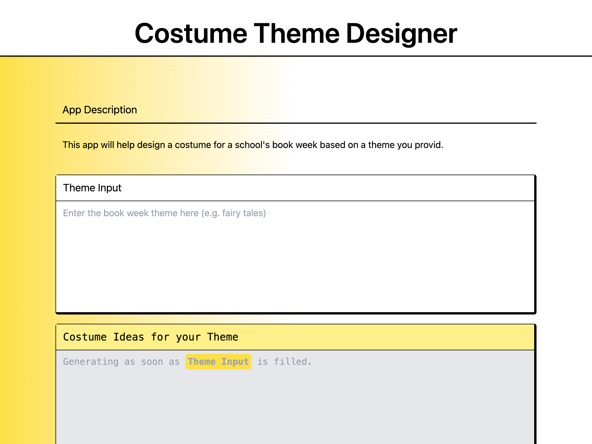

# PartySmith-App-[APPNAME]

This app was built based on an [AWS PartyRock](https://partyrock.aws/) app, using the community project [PartySmith](https://partysmith.ssennett.net/).



It uses [Amazon Bedrock](https://aws.amazon.com/bedrock/) and its Generative AI capabilities to build a fully interactive web application built on [SvelteKit](https://kit.svelte.dev/) and [SST](https://sst.dev/) to easily deploy it as a serverless application to AWS.

> **Note:** Since this is hosted on your own AWS account, you are responsible for the costs for Amazon Bedrock - most of which aren't eligible for coverage by AWS Service Credits.

## Deploying the Application

After downloading and extracting this package from the ZIP file, you can now install the necessary packages, and either run it locally, or deploy it to Amazon Web Services using SST.

First, install the necessary dependencies. This may take some time.

```bash
npm install
```

Now you can launch the application locally by starting the development server, which will launch your app on http://localhost:5173:

```bash
npm run dev
```

If you'd like to deploy your app to AWS, you can do so using SST, if setup during app generation.

```bash
npx sst deploy
```

You can also use `npm` to generate the application's production code to be deployed to other locations. The application can also be deployed to other platforms like Vercel, especially with the use of [Svelte Adapters](https://kit.svelte.dev/docs/adapters).

```bash
npm run build
```

## Customization

The purpose of PartySmith and apps like this is to enable developers to experiment with Amazon Bedrock in web applications.

> **Note:** While PartySmith apps can be used and hosted, they're designed as an experimental platform to help the developer experience, and are not intended for production usage.

Below is some information to help you get started customizing your application.

### Definition File

PartyRock applications use a structured JSON object to determine the application's structure, including the widgets provided to the user. When you generate a PartySmith application, it uses a copy of this JSON object.

You can find the object at `./src/lib/stores/definition.json`.

### Themes and Styling

By default, PartySmith applications will use a stylesheet generated with [Tailwind CSS](https://tailwindcss.com/) to style the application in a manner similar to the default PartyRock theme. You may also have disabled this using the generator.

This project will attempt to load the contents of `./src/app.css`, which can be modified to meet your needs.

### Modifying the Bedrock Calls

Amazon Bedrock is a complex service, with many different options and parameters available for use. By default, this app will simulate the defaults to closely mimic the experience with PartyRock. However, you may want to modify this behaviour, for example to generate higher quality Stable Diffusion images, or to enforce the use of other parameters.

These are handled in the `call-bedrock` api, under the `./src/routes/api/call-bedrock/handlers.ts` file.

## Troubleshooting

### API Calls aren't working at all

Confirm that you have setup an AWS IAM Principal (user or role) which can invoke calls to Amazon Bedrock which is being used by the `call-bedrock` API route. In the SST configuration, this should handled automatically.

Confirm that you have access to each of the models you are using. Before using Amazon Bedrock, you need to request access to each of the models for your AWS Account. You can find more details in the [Amazon Bedrock documentation](https://docs.aws.amazon.com/bedrock/latest/userguide/model-access.html).

### API Calls to Bedrock keep intermittently failing

If you are seeing requests timing out at 10 seconds if your backend is hosted on AWS Lambda, confirm that the function timeout is at least 20 seconds (30 seconds is what I use). Some platforms like [Vercel](https://vercel.com/docs/functions/serverless-functions/runtimes#max-duration) set limits on this for free accounts.
